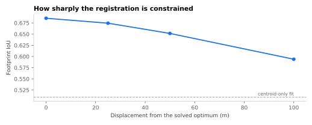

The network comes from `Digital Water.dwg`, an AC1015 (AutoCAD 2000) file from
the IIT Bombay estate office. GDAL's `CAD` driver reads it through libopencad,
so no ODA converter is needed.

```{python}
#| echo: false
import json, pandas as pd
m = json.load(open("data/manifest.json"))
cad = m["cad"]
pd.DataFrame({
  "": ["Source file", "Pipe layers used", "Centreline features",
       "Diameter annotations parsed", "Asset notes parsed"],
  " ": [cad["source"], ", ".join(cad["pipe_layers"]), cad["n_lines"],
        cad["n_diameter_labels"], cad["n_asset_notes"]],
}).style.hide(axis="index")
```

## Four problems in one file

**The layer names lie.** `Water Supply Line` holds the mains — and also
buildings, roads and the Powai lake shoreline. Selecting layers by keyword
matches `Water Line Dia Text` and `Water Meter` too, so the layer picker needs
an explicit veto list for text, meter, hydrant and symbol layers.

**The sheet carries the network twice.** Once draped over the campus base map,
once as a clean standalone copy. The base-map version wins on total length —
207 km against 18 km — because the buildings and roads are counted with it. The
pipeline georeferences first, then keeps the block that falls inside the campus
boundary; picking by length gets it exactly backwards.

**The annotations are in four notations.** `6"`, `3"G.I.`, `12"C.I.`,
`NEW 250MM`, plus asset notes — `P/H` for pump house, `A.V.` air valve, `W.O.`
wash out, `NON RETURN VALUE` for the valve. The inch ladder maps onto the same
40/50/75/100/150/250/300 mm set that appears in the original study's QGIS
legend, which is how we know this is the drawing that study used.

**The network is not connected.** Branch lines are drawn as separate polylines
that stop short of the main. 51 components, median gap 31 m. Raising the snap
tolerance does not help — at 5 m there are still 51.

## What the repair does

```{python}
#| echo: false
import pandas as pd
pd.DataFrame([
 ["Weld endpoints", "union-find over a KD-tree at 0.5 m"],
 ["Node and merge", "split at intersections, collapse degree-2 chains"],
 ["Prune dangles", "drop dead-end stubs under 7 m"],
 ["Bridge islands", "shortest connector to the main graph, up to 150 m"],
 ["Contract slivers", "weld the ends of links under 0.5 m — never delete them"],
 ["Split rings", "halve any link that starts and ends at the same node"],
 ["Keep largest", "one connected component, with the discarded length reported"],
], columns=["Step", "What it does"]).style.hide(axis="index")
```

The sliver step is the one that matters and the one that is easy to get wrong.
Deleting short links instead of contracting them severs the graph wherever a
sliver sits between two real branches — in this network that quietly removed
40 % of the pipe before the mistake was caught by the length report.

::: {.caveat}
Island bridging **adds pipes that are not in the drawing**: 48 connectors,
about 1.3 km. They are the shortest links that make the network solvable, and
the count and total length print on every run. Anyone using the hydraulics
should look at them before trusting a result.
:::

## Georeferencing

CAD carries no coordinate system. Rather than hand-picking control points —
where two clicks carry the entire weight of the fit — the transform is solved
by optimising the intersection-over-union of the network footprint against the
digitised campus boundary. Every metre of pipe contributes.

{fig-alt="IoU against displacement from the solved optimum"}

```{python}
#| echo: false
import json
m = json.load(open("data/manifest.json"))
r = m["registration"]
print(f"Solved IoU **{r['iou']:.3f}**, against **{r['centroid_only_iou']:.3f}** "
      f"for a centroid-only fit. Contrast at 100 m is "
      f"**{r['contrast_100m']:+.3f}** — the optimum is a peak, not a plateau, "
      f"which is what says the footprint genuinely keys into the boundary.")
```

Validated against ground truth on a synthetic case, the method recovers a known
transform to 31 m translation-only and 12 m with rotation enabled. That is
adequate for sampling a 30 m DEM. It is not survey grade, and the site says so
wherever a number depends on it.
