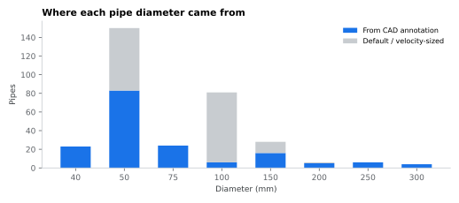
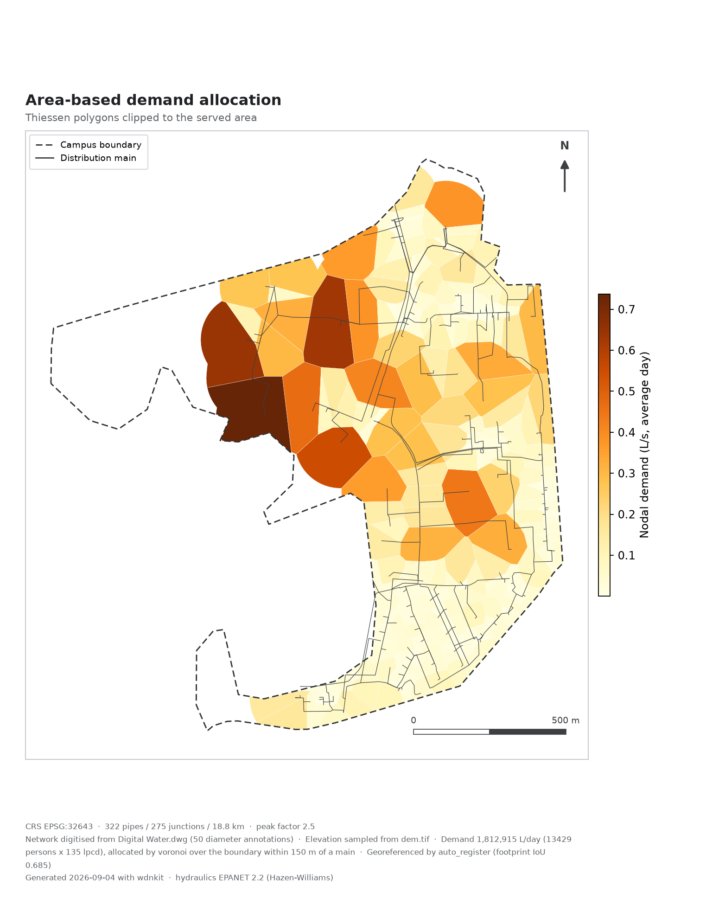
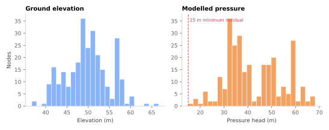
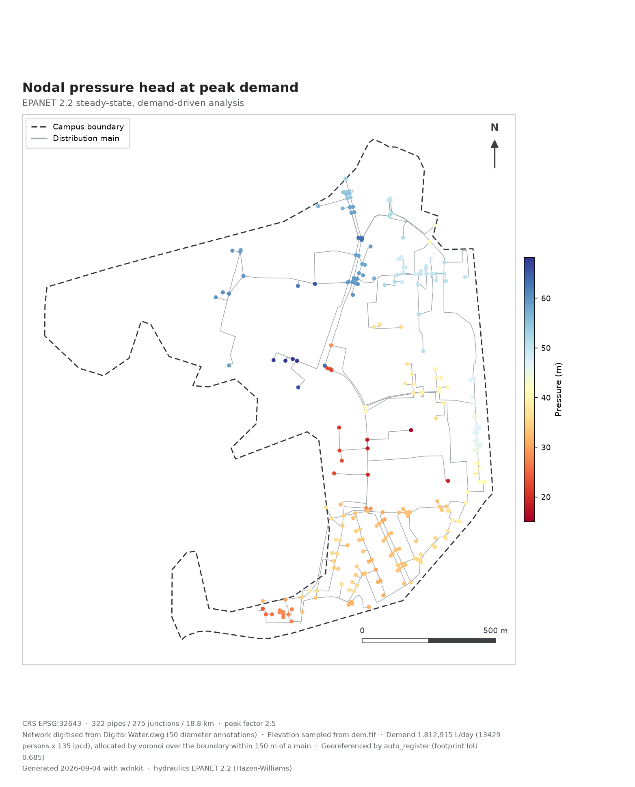

```{python}
#| echo: false
import json, pandas as pd
m = json.load(open("data/manifest.json"))
mod, c, d = m["model"], m["counts"], m["model"]["demand"]
pd.DataFrame({
 "": ["Junctions", "Pipes", "Total length", "Dead ends",
      "Demand basis", "Average day", "Peak factor",
      "Source node", "Source head", "Headloss"],
 " ": [c["junctions"], c["pipes"], f"{c['pipe_length_km']} km", c["dead_ends"],
       f"{d['population']:,} persons x {d['lpcd']} lpcd = {d['total_lpd']:,.0f} L/day",
       f"{d['avg_day_lps']} L/s", mod["peak_factor"], mod["source_node"],
       f"{mod['source_head_m']} m", "Hazen-Williams"],
}).style.hide(axis="index")
```

## Diameters

Only about half the pipes carry a usable annotation, so the rest need a
defensible number. The rule is: take the nearest CAD label within 60 m, cap
dead-end services at 50 mm, then raise anything whose peak flow would exceed
1.5 m/s to the next commercial size.

{fig-alt="Pipes by diameter, split by whether the value came from CAD"}

CAD values are never reduced — only raised, and only by the velocity criterion.
Both numbers survive into `pipes.csv` as `diameter_cad_mm` and `diameter_mm`, so
every change is auditable.

::: {.caveat}
The flow used for sizing comes from a spanning tree rooted at the source, which
cannot see loop redistribution. One pipe in this network carries seven times its
tree estimate. Only one of 322 exceeds the velocity target in the solved model,
so the practical effect is small, but the method is systematically optimistic on
looped sections.
:::

## Demand

Demand is allocated by Thiessen polygon area — the method the original study
used — but clipped to ground within 150 m of a main. Without that clip the
tessellation hands unserved land to whichever peripheral node happens to be
nearest, and on this campus 16 % of the boundary is more than 150 m from any
pipe. Unclipped, a single dead end ended up carrying 12.5 % of total campus
demand. Clipped, the largest node holds 3.5 %.

{fig-alt="Area-based demand allocation"}

## Results

{fig-alt="Elevation and pressure distributions"}

{fig-alt="Modelled pressure at peak demand"}

```{python}
#| echo: false
import json
m = json.load(open("data/manifest.json"))
p, e = m["model"]["pressure_m"], m["model"]["elevation_m"]
print(f"Elevation spans {e['min']:.1f}–{e['max']:.1f} m; pressure "
      f"{p['min']:.1f}–{p['max']:.1f} m with a median of {p['median']:.1f} m.")
```

::: {.caveat}
The source head is calibrated so the *worst* node holds a 15 m residual, which
means one high node sets the hydraulic grade for the whole network and
everything low-lying is over-pressurised as a consequence. Roughly a sixth of
nodes sit above 55 m. That is partly a real finding — 30 m of relief in a single
zone wants pressure-reducing valves — and partly an artefact of calibrating on a
single extreme node.
:::
