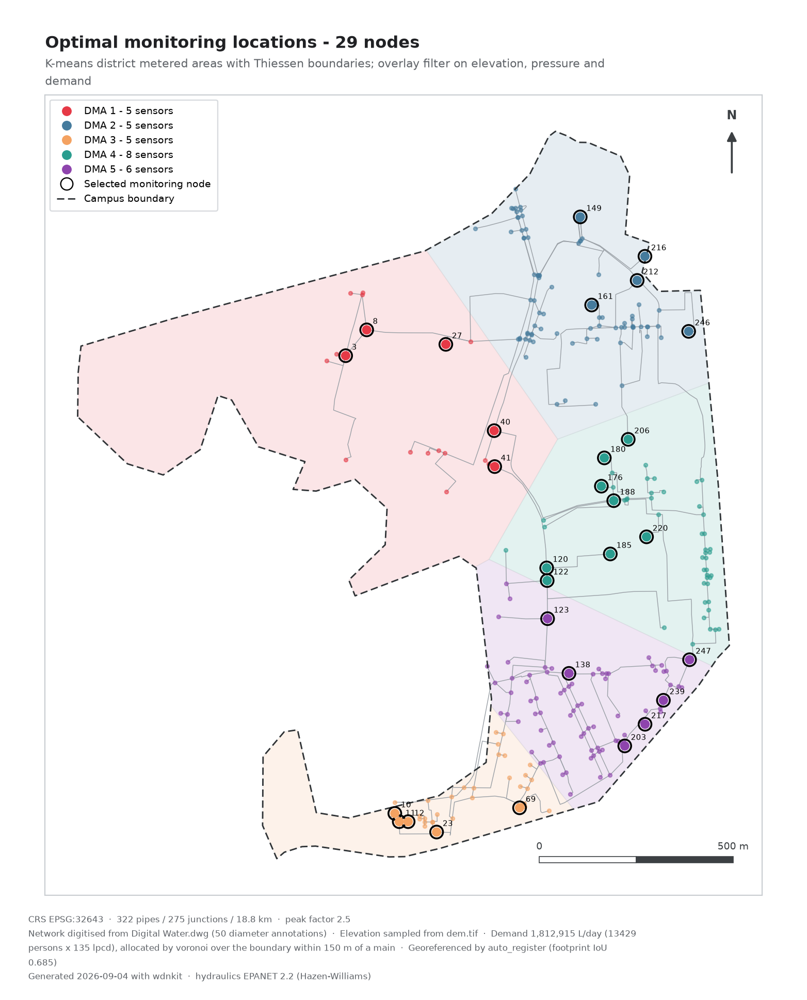
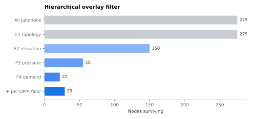

Where do you put a limited number of water-quality sensors on 18.8 km of main?
The approach reproduces the original study: partition the network into district
metered areas, then filter each district on network topology, terrain, pressure
and demand, with thresholds computed *per district* so a low-lying zone is not
excluded by a criterion calibrated on a hilly one.

## Zoning

K-means on junction coordinates, then Thiessen tessellation of the cluster
centroids. Five districts, matching the original.

{fig-alt="Optimal sensor locations by district"}

## The filter

| | Criterion | Rationale |
|---|---|---|
| F1 | junction or dead end | bends carry no operational information |
| F2 | elevation above the district mean | high points are critical for performance |
| F3 | pressure in the district's bottom or top fifth | low risks intrusion, high risks leakage |
| F4 | demand above the district mean | fluctuation propagates furthest from high-demand nodes |

{fig-alt="Nodes surviving each filter stage"}

```{python}
#| echo: false
import json
m = json.load(open("data/manifest.json"))
a, per = m["placement"], m["per_dma"]
print(f"{a['selected']} nodes selected — {a['f1_f2_f3_f4']} from the filter "
      f"chain and {a['topped_up']} added by a per-district floor so that no "
      f"zone is left unmonitored. Distribution across districts: "
      + ", ".join(f"DMA {k} → {v}" for k, v in per.items()) + ".")
```

::: {.caveat}
**F1 does nothing in this network.** Collapsing degree-2 chains during topology
cleanup leaves no bends at all — every node is a junction or a dead end — so the
first criterion passes everything. The filter is honestly three stages, not
four. It is left in because it would bite on a network built without chain
merging, but the attrition chart shows it flat and that is not hidden.
:::

The selection skews toward dead ends, which follows from F3: branch tips carry
the pressure extremes. If the monitoring intent were leak detection on the
backbone rather than water quality at the extremities, the weighting would want
revisiting.
