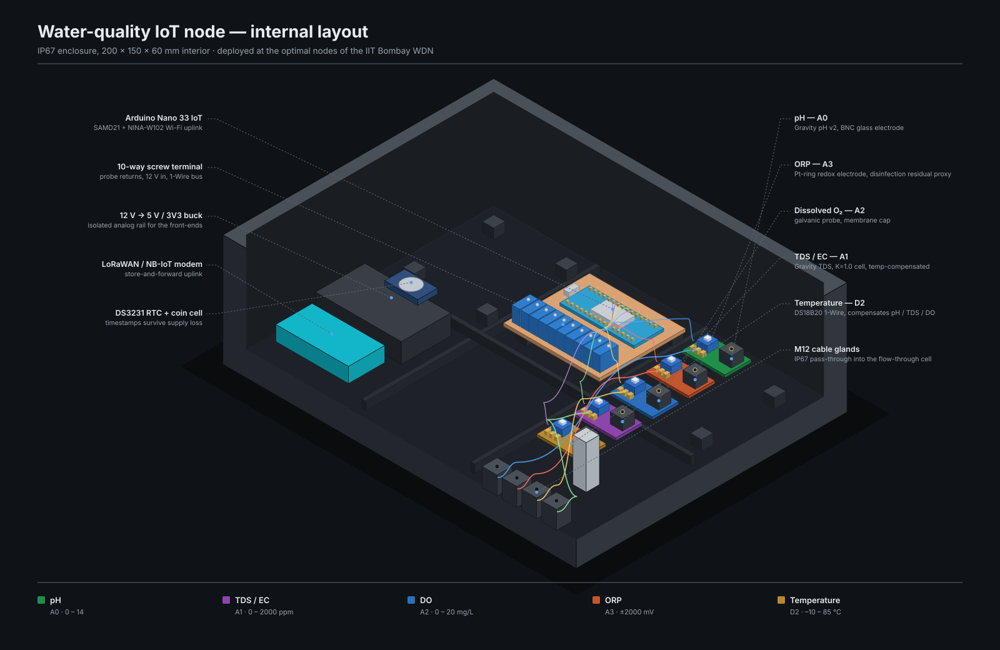

Each selected location gets a sensor node reporting five parameters over a
Wi-Fi or LoRaWAN uplink. The suite follows the original study's build.

{fig-alt="Isometric cutaway of the water quality node"}

| Sensor | Property | Pin | Interface | Range |
|---|---|---|---|---|
| Gravity pH v2 | pH | A0 | analog | 0 – 14 |
| Gravity TDS | total dissolved solids | A1 | analog | 0 – 2000 ppm |
| Galvanic DO probe | dissolved oxygen | A2 | analog | 0 – 20 mg/L |
| ORP meter | redox potential | A3 | analog | ±2000 mV |
| DS18B20 | water temperature | D2 | 1-Wire | −10 – 85 °C |

Temperature is not one parameter among five — pH, TDS and dissolved oxygen all
need it for compensation. That dependency is modelled explicitly in the ontology
as `wdn:compensatedBy`, which is what makes the provisioning check in the
[explorer](07-explorer.qmd) possible: a station hosting a compensated sensor but
no temperature probe is a configuration error the graph can find on its own.

## Firmware

The sketch extends the original with median-of-21 sampling to reject the spikes
that analog ion-selective front-ends pick up from nearby pump drives, two-point
pH calibration in EEPROM, and a JSON payload whose keys are the ontology's local
names — so a published message maps onto `sosa:Observation` individuals with no
translation layer.

```cpp
StaticJsonDocument<384> doc;
doc["stationId"]                   = "Station_J141";
doc["waterTemperature"]            = serialized(String(tempC, 2));
doc["pH"]                          = serialized(String(ph, 2));
doc["oxidationReductionPotential"] = serialized(String(orp, 1));
doc["totalDissolvedSolids"]        = serialized(String(tds, 0));
doc["dissolvedOxygen"]             = serialized(String(doMgL, 2));
```

::: {.caveat}
The enclosure render is representative geometry, not a dimensioned CAD assembly.
It shows the layout and the signal path; it is not a build drawing.
:::
