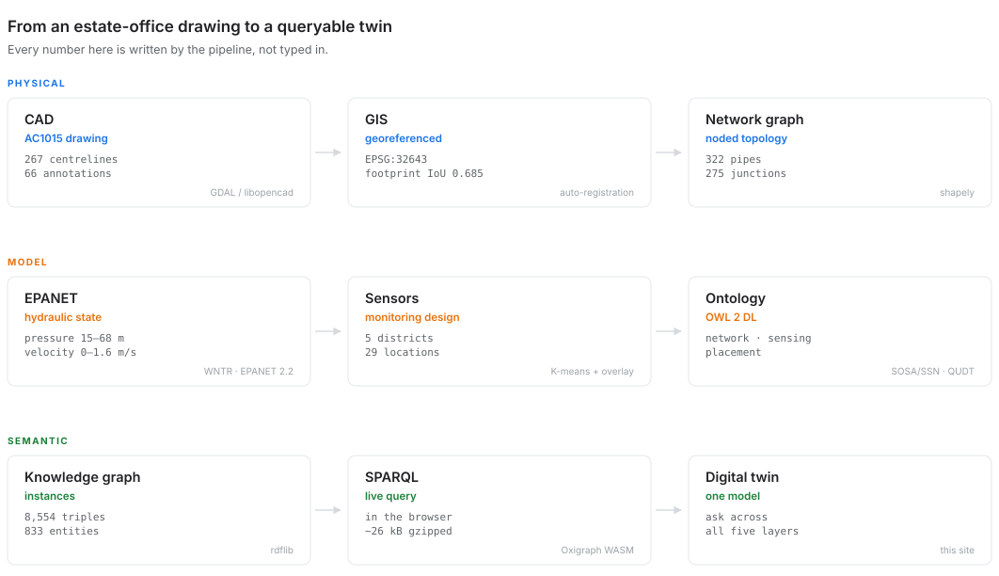

```{=html}
<link href="https://cdn.jsdelivr.net/npm/maplibre-gl@4.7.1/dist/maplibre-gl.css" rel="stylesheet">
<script src="https://cdn.jsdelivr.net/npm/maplibre-gl@4.7.1/dist/maplibre-gl.js"></script>
```

::: {.hero-lede}
A campus water network exists as five disconnected artefacts:

1. CAD drawing in the estate office
2. hydraulic model
3. spreadsheet of sensor locations
4. firmware repository
5. diagram of what those sensors measure

Each is intelligible alone. None can answer a question that spans two of them.
This connects all five, so questions like the one below become a query rather
than a fortnight of cross-referencing.
:::

```{=html}
<div class="hero">
  <div id="hero-map"></div>
  <div class="hero-panel">
    <div id="hero-tabs"></div>
    <p class="hero-q" id="hero-question"></p>
    <p class="hero-why" id="hero-why"></p>
    <pre id="hero-sparql"></pre>
    <div class="hero-actions">
      <button id="hero-run" disabled>Run again</button>
      <span class="wdn-status" id="hero-status">Starting the triplestore…</span>
    </div>
    <div id="hero-results"></div>
  </div>
</div>
<script type="module" src="assets/hero.js"></script>
```

Every one of those questions is evaluated **in your browser**, against the whole
graph, when you press the button. Nothing is pre-computed and there is no
server: the model is small enough — about 26 kB of triples — that the query
engine can be shipped to the reader instead of the other way round.

[Open the full explorer](07-explorer.qmd){.btn .btn-primary} &nbsp;
[See what is in the graph](06-knowledge-graph.qmd){.btn .btn-outline-secondary}

```{python}
#| echo: false
#| output: asis
import json
m = json.load(open("data/manifest.json"))
c = m["counts"]
cells = [(f"{c['pipes']}", "pipes"), (f"{c['junctions']}", "junctions"),
         (f"{c['pipe_length_km']} km", "of main"), (f"{c['sensors']}", "sensor nodes"),
         (f"{c['dmas']}", "district areas"), (f"{c['triples']:,}", "triples")]
print('<div class="statbar">')
for n, l in cells:
    print(f'<div><div class="n">{n}</div><div class="l">{l}</div></div>')
print('</div>')
```

## How it fits together

{fig-alt="Nine-stage pipeline from CAD drawing to digital twin"}

Each stage produces an artefact the next one consumes, and the last three turn
those artefacts into something a machine can reason over. The numbers in that
diagram are written by the pipeline, so they cannot drift from the run that
produced this page.

| Layer | Artefact | Section |
|---|---|---|
| Physical network | AC1015 AutoCAD drawing, 66 estate annotations | [Source data](01-source-data.qmd) |
| Hydraulic model | EPANET 2.2, Hazen-Williams, peak demand | [Hydraulic model](02-hydraulic-model.qmd) |
| Monitoring design | K-means districts + hierarchical overlay filter | [Sensor placement](03-sensor-placement.qmd) |
| Instrumentation | Five-parameter water-quality node | [IoT node](04-iot-node.qmd) |
| Semantics | OWL 2 DL, aligned to SOSA/SSN and QUDT | [Ontology](05-ontology.qmd) |
| Knowledge graph | 8,554 triples, schema derived from the data | [Knowledge graph](06-knowledge-graph.qmd) |
| Query | Client-side SPARQL over the whole graph | [Explorer](07-explorer.qmd) |

## The hard part is the input drawing

A naive import produces something EPANET refuses to solve, and the failure is a
bare `Error 110` with no hint that the cause is topological.

Most of the engineering here is getting from a messy drawing — wild
annotations, missing polylines and connections — to a graph a solver will
accept, without silently deleting the parts that do not fit.

## Limitations

::: {.limits}
**The georeference is solved, not surveyed.** The CAD carries no CRS. The
transform comes from optimising the network footprint against a digitised campus
boundary — good to roughly 10–30 m, which is adequate for sampling a 30 m DEM
and not adequate for anything else.

**Elevations are FABDEM at 30 m**, so nodes closer together than the posting
share a value.

**Pressures are modelled**, from one steady-state run at a 2.5 peak factor, and
inherit every assumption above.

**48 island-bridging pipes are not in the drawing.** They are the shortest
connectors that make the network solvable, and they are reported on every run.
:::
